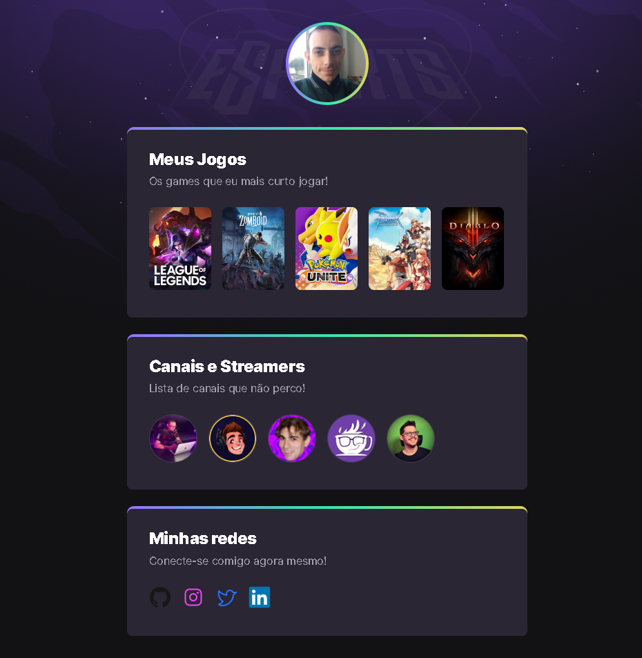

#  Projeto Game Hub

<<<<<<< HEAD
> Next Level Week eSports - Trilha Explorer.
=======
# :mortar_board: Projeto Finalizado
Next Level Week eSports - Trilha Explorer. 
  
  

>>>>>>> 881da324a45fb5d471c2baf00680bf231ab3ba44

  
# 🔖 Layout

O layout você poderá acessar através desse [link](https://www.figma.com/community/file/1150897317533332617). O meu projeto voce acessa [aqui.](https://thiagodarruda.github.io/NLW-Esports-Rocketseat/)

# 🚀 Tecnologias

Esse projeto utiliza as seguintes tecnologias:

<<<<<<< HEAD
- HTML
- CSS
- GIT
- Github
=======
* HTML
* CSS
* GIT

###### Este projeto está sendo desenvolvido durante a Next Level Week eSports, realizada pela @Rocketseat 💜.

#neverstoplearning
>>>>>>> 881da324a45fb5d471c2baf00680bf231ab3ba44
